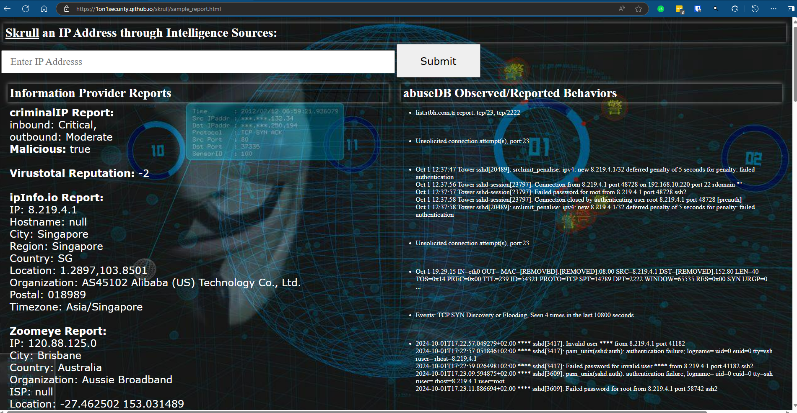

## Skrull Contents


**SKRULL**

<https://github.com/1on1security/skrull>

I honestly don't know when and where the term "skrull" entered my brain. I don't think the Marvel Cinematic Universe is nearly as responsible as the movie [Krull](https://www.imdb.com/title/tt0085811/?ref_=ext_shr_lnk) back in the day. Krull is a 1983 science fantasy swashbuckler film directed by Peter Yates and written by Stanford Sherman. It follows Prince Colwyn and a fellowship of companions who set out to rescue his bride, Princess Lyssa, from a fortress of alien invaders who have arrived on their home planet. [wikipedia](https://en.wikipedia.org/wiki/Krull_(film))

Necessity being the mother of invention, I needed a tool that could query some of my favorite informational sources to garner a **well-rounded report** for a given IP address.  I'm making use of a handful of platorms to accomplish this, including:

- <https://maltiverse.com/>
- <https://www.abuseipdb.com/>
- <https://www.criminalip.io/>
- <https://ipinfo.io/>
- <https://www.virustotal.com/>
- <https://shodan.io/>
- <https://www.zoomeye.hk/>

Services offering a public API are relatively easy to add to the pile.



---

For the most part I've tried to make this as simple as:

1. Clone the repo:
    - git clone https://github.com/1on1security/skrull.git

2. Sign up for an API key at each of the services.
    - You'll need to visit each of the services above and sign up for an API key.

3. Store those keys in the appropriate file.
    - The default anticipated location is **~/KEYS/auth.txt** and can be changed in the vars file.

> The format of this file is (**no quotes!**):<br>
    abuse_key=0xxxx<br>
    criminal_ip_key=0xxxx<br>
    ipinfo_key=0xxxx<br>
    maltiverse_key=0xxxx<br>
    virus_total_key=0xxxx

4. Install and initialize shodan
    - pip install shodan
    - pip init [*Your api key here*]

## CLI Usage: skrull.bash [*ipaddress*]

[Sample Report CLI](sample_report.txt)

[Sample Report HTML](https://1on1security.github.io/skrull/sample_report.html)

## What's here:

```
.
├── abuseipdb.bash          - Bash: AbuseIP script
├── anonymous.jpg           - Image: anonymous
├── criminalIpReport.py     - Python: CriminalIP Host Report
├── criminalMalReport.py    - Python: CriminalIP Malware Report for IP
├── ipinfo.bash             - Bash: ipInfo Host Report
├── krull.png               - Image: krull
├── maltiverse.bash         - Bash: Maltiverse report for a given IP
├── README.md               - This file
├── sample_report.html      - Sample HTML report
├── sample_report.md        - Sample Text report
├── shodan                  - Python: Shodan client
├── skrull.bash             - Bash: **"The Sauce"** combining all reports
├── skrullHtml.png          - Image: html sample report preview
├── vars                    - Bash: Variables referenced by scripts in project
├── vt                      - vt: ELF 64-bit LSB executable, x86-64
└── zoomeye.bash            - Bash: zoomeye Report
```

---

### This is great!  How do I get that pretty HTML reporting?
I've developed and tested on Ubuntu 24.04 with ngnix server.  You can pull the repo to your home directory, copy two files, and modify /etc/sudoers (with visudo) and you'll be on your way for the most part.

```
cd
git clone https://github.com/1on1security/skrull.git
cp skrull/skrull.php skrull/anonymous.jpg /var/www/html/
```

/etc/sudoers entries allowing www-data user to execute bash scripts.<br>
(sudo visudo)

```
www-data ALL=(ALL:ALL) NOPASSWD: /home/YOURUSERNAME/skrull/skrull.bash
www-data ALL=(ALL:ALL) NOPASSWD: /home/YOURUSERNAME/skrull/abuseipdb.bash
```