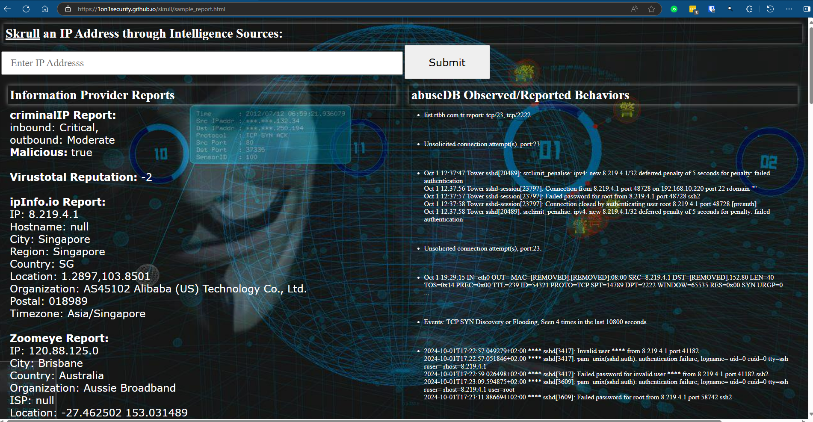
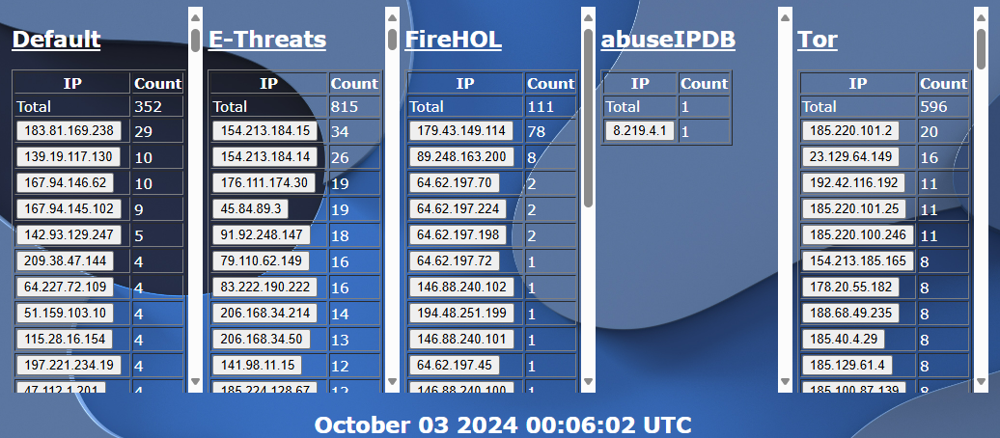

## Skrull
<https://github.com/1on1security/skrull>


**SKRULL** - Verb, to pass an IP address through several informational lookup/reporting services. Necessity being the mother of invention, I cobbled together a tool that could query some of my favorite informational sources to garner a **well-rounded report** for a given IP address.

I honestly don't know when and where the term "skrull" entered my brain. I don't think the Marvel Cinematic Universe is nearly as responsible as the movie [Krull](https://www.imdb.com/title/tt0085811/?ref_=ext_shr_lnk) back in the day. Krull is a 1983 science fantasy swashbuckler film directed by Peter Yates and written by Stanford Sherman. It follows Prince Colwyn and a fellowship of companions who set out to rescue his bride, Princess Lyssa, from a fortress of alien invaders who have arrived on their home planet. [wikipedia](https://en.wikipedia.org/wiki/Krull_(film))

Scrub and Lookup?  Scrub it *through* a lookup? [shrugs]



I'm making use of a handful of platorms to accomplish this, including:

- <https://maltiverse.com/>
- <https://www.abuseipdb.com/>
- <https://www.criminalip.io/>
- <https://ipinfo.io/>
- <https://www.virustotal.com/>
- <https://shodan.io/>
- <https://www.zoomeye.hk/>
- <https://ip2location.io>

Services offering a public API are relatively easy to add to the pile.  Adding ip2location.ip today took me about twenty minutes; 1. Get API key, 2. Add API key to ~/KEYS/skrull_auth.txt., 3. A couple of lines of Bash to test some queries with curl, 4. Familiarize myself with the specific verbiage of the .json results returned, and 5. Massage my jq query to format output as desired.

## Why is this useful?
Information sites can provide conflicting data at times - and sometimes that conflict is literally */the/* needle in the haystack - or a thread leading towards one.  This tool can be a bit clunky.  Web reporting can take upwards of thirty seconds for the queries under the hood to complete, and they're executing in series.  My specific use case, however, takes advantage of the self-referrencing "POST" action of the skrull.php web form.  This allows deep linking in other reporting tools to "skrull an IP" without opening a new tab or typing.  [For example, when viewing the firewall widget below, clicking any report button launches a skrull session in a new tab for that IP address.  Stay tuned for that repo once I scrub it for public consumption!]



##**REQUIREMENTS**
This blob of code presumes you have a LAMP stack and are comfortable configuring Apache/Nginx and PHP to function properly. A whole host of topics such as selinux or apparmor can prevent proper function when configuring the web component.  Alas, they fall far beyond the scope of this document. 

For the most part I've tried to make this as simple as:

1. Clone the repo:
    - git clone https://github.com/1on1security/skrull.git

2. Sign up for an API key at each of the services.
    - You'll need to visit each of the services above and sign up for an API key.

3. Store those keys in the appropriate file.
    - The default anticipated location is **~/KEYS/auth.txt** and can be changed in the vars file.

> The format of this file is (**no quotes!**):<br>
    abuse_key=xxxx<br>
    criminal_ip_key=xxxx<br>
    ipinfo_key=xxxx<br>
    maltiverse_key=xxxx<br>
    virus_total_key=xxxx...

4. Install and initialize shodan
    - pip install shodan
    - pip init [*Your api key here*]

## CLI Usage: skrull.bash [*ipaddress*]

[Sample Report CLI Format](sample_report.md)

Note: AbuseDB "reported behaviors" output is not included in the CLI verion of the report; it's executed separately to populate the right-hand pane of the HTML report when executing via a browser.

[Sample Report HTML Format](https://1on1security.github.io/skrull/sample_report.html)

## What's here:

```
.
├── abuseipdb.bash          - Bash: AbuseIP script
├── anonymous.jpg           - Image: anonymous
├── criminalIpReport.py     - Python: CriminalIP Host Report
├── criminalMalReport.py    - Python: CriminalIP Malware Report for IP
├── ipinfo.bash             - Bash: ipInfo Host Report
├── krull.png               - Image: krull
├── maltiverse.bash         - Bash: Maltiverse report for a given IP
├── README.md               - This file
├── sample_report.html      - Sample HTML report
├── sample_report.md        - Sample Text report
├── shodan                  - Python: Shodan client
├── skrull.bash             - Bash: **"The Sauce"** combining all reports
├── skrullHtml.png          - Image: html sample report preview
├── vars                    - Bash: Variables referenced by scripts in project
├── vt                      - vt: ELF 64-bit LSB executable, x86-64
└── zoomeye.bash            - Bash: zoomeye Report
```

---

### This is great!  How do I get that pretty HTML reporting?
I've developed and tested on Ubuntu 24.04 with ngnix server.  You can pull the repo to your home directory, copy files to your webroot. Then modify /etc/sudoers (with visudo) and you'll be on your way for the most part.  Forgive the prolixity but the purpose of the /etc/sudoers entries is to allow the www-data user to execute our two scripts via sudo, without providing a password.  **DANGEROUS!**

```
cd
git clone https://github.com/1on1security/skrull.git
cd skrull && ./web_install.bash
```

```
www-data ALL=(ALL:ALL) NOPASSWD: /home/YOURUSERNAME/skrull/skrull.bash
www-data ALL=(ALL:ALL) NOPASSWD: /home/YOURUSERNAME/skrull/abuseipdb.bash
```
